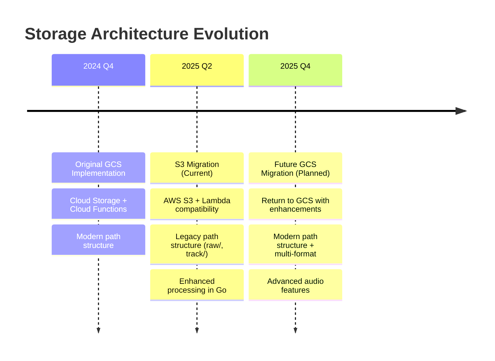

# Documentation Index

This directory contains comprehensive documentation for the Wavlake API. Start here to understand how everything works.

## 📋 **Quick Start**

1. **[CURRENT_ARCHITECTURE.md](CURRENT_ARCHITECTURE.md)** - How the API works today (start here)
2. **[README.md](README.md)** - Basic setup and development guide
3. **[CLAUDE.md](CLAUDE.md)** - AI assistant context and development commands

## 🏗️ **Architecture Documentation**

### Current Production System
- **[CURRENT_ARCHITECTURE.md](CURRENT_ARCHITECTURE.md)** - Complete current architecture (S3-based)
- **[S3_IMPLEMENTATION.md](S3_IMPLEMENTATION.md)** - Technical details of S3 implementation

### API Features
- **[README_NOSTR_TRACKS.md](README_NOSTR_TRACKS.md)** - Nostr track upload API documentation
- **[LEGACY_API_TYPES.md](LEGACY_API_TYPES.md)** - Legacy PostgreSQL API types and interfaces

## 🚀 **Future Plans**

- **[GCS_MIGRATION_PLAN.md](GCS_MIGRATION_PLAN.md)** - Detailed plan for future S3→GCS migration

## 📁 **Document Organization**

### **Current State** (How things work today)
```
CURRENT_ARCHITECTURE.md          ← Complete current architecture document
└── S3_IMPLEMENTATION.md         ← Technical S3 implementation details
```

### **Development & Usage**
```
README.md                        ← Basic setup and usage
├── README_NOSTR_TRACKS.md       ← API usage examples
├── LEGACY_API_TYPES.md          ← Type definitions
└── CLAUDE.md                    ← Development assistant configuration
```

### **Future Planning**
```
GCS_MIGRATION_PLAN.md            ← Future migration from S3 back to GCS
```

## 🎯 **What to Read Based on Your Goal**

### **I want to understand how the API works today**
→ Start with **[CURRENT_ARCHITECTURE.md](CURRENT_ARCHITECTURE.md)**

### **I want to set up the development environment**
→ Start with **[README.md](README.md)**

### **I want to use the track upload API**
→ Read **[README_NOSTR_TRACKS.md](README_NOSTR_TRACKS.md)**

### **I want to understand the S3 implementation**
→ Read **[S3_IMPLEMENTATION.md](S3_IMPLEMENTATION.md)**

### **I want to plan the future GCS migration**
→ Read **[GCS_MIGRATION_PLAN.md](GCS_MIGRATION_PLAN.md)**

### **I want to work with Claude Code**
→ Read **[CLAUDE.md](CLAUDE.md)**

## 📊 **Architecture Evolution**



## ✅ **Documentation Quality Standards**

All documentation in this repository follows these standards:

- **Current**: Reflects production reality
- **Complete**: Covers setup, usage, and troubleshooting
- **Clear**: No ambiguity about current vs future state
- **Organized**: Logical structure with clear navigation
- **Maintained**: Updated with code changes

## 🔄 **Document Lifecycle**

- **Current State Docs**: Updated immediately when code changes
- **Implementation Docs**: Created during development, finalized at completion
- **Future Planning Docs**: Updated as plans evolve, archived when implemented

---

**Last Updated**: July 2025  
**Total Documents**: 7 core documents  
**Status**: All current-state documentation reflects production reality