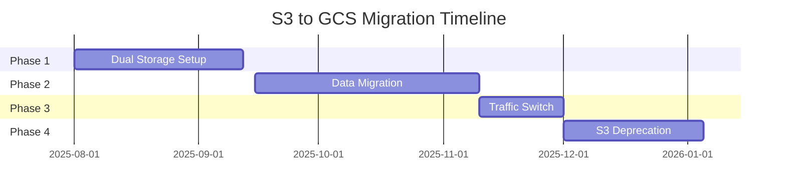

# GCS Migration Plan

## Executive Summary

This document outlines the plan to migrate the Wavlake API from AWS S3 back to Google Cloud Storage (GCS) with significant enhancements. This is a **future migration** that will happen after the current S3 implementation has stabilized.

**Timeline**: Q3-Q4 2025 (estimated 16-22 weeks)  
**Risk Level**: Medium (with proper planning and rollback capability)  
**Expected Benefits**: 20-25% cost reduction, enhanced features, simplified infrastructure

## Migration Context

### Why We Originally Used GCS
- Native integration with Google Cloud Platform
- Automatic Cloud Function triggers
- Unified billing and monitoring
- Better performance with Cloud Run

### Why We Migrated to S3
- Legacy catalog API compatibility requirement
- Existing AWS infrastructure (buckets, Lambda, CDN)
- Minimize disruption during PostgreSQL migration
- Team familiarity with S3 paths and structure

### Why Migrate Back to GCS
1. **Cost Optimization**: Single cloud provider, no cross-cloud fees
2. **Better Integration**: Native GCP services work seamlessly
3. **Enhanced Features**: Modern path structure, multiple formats
4. **Simplified Operations**: One cloud provider to manage
5. **Future Innovation**: Leverage GCP AI/ML for audio processing

## Migration Strategy Overview

### 4-Phase Approach

**Phase 1: Dual Storage (4-6 weeks)**
- Add GCS writing alongside S3
- Continue reading from S3
- No user impact

**Phase 2: Data Migration (6-8 weeks)**
- Copy all S3 data to GCS
- Restructure paths for better organization
- Enhance audio files with new features

**Phase 3: Traffic Switch (2-3 weeks)**
- Gradually move read traffic to GCS
- Monitor performance and errors
- Maintain S3 as fallback

**Phase 4: S3 Sunset (4-5 weeks)**
- Disable S3 writes
- Archive S3 data
- Remove S3 dependencies

## Technical Architecture

### New GCS Structure

```
gs://wavlake-audio-v2/
├── tracks/
│   ├── original/
│   │   └── {trackId}/
│   │       ├── metadata.json     # Track metadata
│   │       └── source.{ext}      # Original file
│   │
│   └── compressed/
│       └── {trackId}/
│           ├── versions.json     # Available versions
│           ├── default.mp3       # 128kbps (legacy)
│           ├── high_256.mp3      # High quality
│           ├── medium_128.aac    # AAC format
│           └── low_96.ogg        # Low bandwidth
│
├── waveforms/
│   └── {trackId}/
│       └── waveform.json         # Visualization data
│
└── previews/
    └── {trackId}/
        ├── preview_30s.mp3       # 30-second preview
        └── preview_60s.mp3       # 60-second preview
```

### Path Mapping

| Current S3 Path | Future GCS Path | Purpose |
|-----------------|-----------------|----------|
| `raw/{id}.mp3` | `tracks/original/{id}/source.mp3` | Original upload |
| `track/{id}.mp3` | `tracks/compressed/{id}/default.mp3` | Default compression |
| N/A | `tracks/compressed/{id}/high_256.mp3` | High quality (new) |
| N/A | `waveforms/{id}/waveform.json` | Visualization (new) |
| N/A | `previews/{id}/preview_30s.mp3` | Preview clip (new) |

## Implementation Plan

### Phase 1: Dual Storage Implementation

#### 1.1 Create Dual Storage Service
```go
// internal/services/storage_dual.go
type DualStorageService struct {
    primary   StorageServiceInterface  // S3 (current)
    secondary StorageServiceInterface  // GCS (new)
    config    DualStorageConfig
}

type DualStorageConfig struct {
    WriteToSecondary bool     // Enable dual writes
    ReadFromSecondary bool    // Enable GCS reads
    SecondaryReadPercent int  // Percentage of reads from GCS
}
```

#### 1.2 Environment Configuration
```bash
# Enable dual storage
STORAGE_PROVIDER=dual
DUAL_PRIMARY=s3
DUAL_SECONDARY=gcs
DUAL_WRITE_ENABLED=true
DUAL_READ_PERCENTAGE=0  # Start with 0% GCS reads

# GCS configuration
GCS_BUCKET_NAME=wavlake-audio-v2
GCS_USE_MODERN_PATHS=true
```

#### 1.3 Create GCS Bucket
```bash
# Create bucket with versioning
gsutil mb -p $PROJECT_ID -c STANDARD -l us-central1 gs://wavlake-audio-v2/
gsutil versioning set on gs://wavlake-audio-v2/

# Set CORS for direct uploads
gsutil cors set gcs-cors.json gs://wavlake-audio-v2/
```

### Phase 2: Data Migration

#### 2.1 Migration Service
```go
// internal/services/migration.go
type S3ToGCSMigrationService struct {
    s3Service  *S3StorageService
    gcsService *StorageService
    db         *firestore.Client
    logger     *log.Logger
}

func (m *S3ToGCSMigrationService) MigrateTrack(trackID string) error {
    // 1. Read track metadata from Firestore
    // 2. Download original from S3
    // 3. Generate enhanced versions
    // 4. Upload all versions to GCS
    // 5. Update Firestore with GCS URLs
    // 6. Mark as migrated
}
```

#### 2.2 Migration API Endpoint
```go
// POST /v1/admin/migrate-track
type MigrateTrackRequest struct {
    TrackID string `json:"track_id"`
    Options MigrationOptions `json:"options"`
}

type MigrationOptions struct {
    GenerateWaveform bool `json:"generate_waveform"`
    CreatePreviews   bool `json:"create_previews"`
    EnhanceQuality   bool `json:"enhance_quality"`
}
```

#### 2.3 Batch Migration Script
```python
#!/usr/bin/env python3
# migrate_tracks.py

import boto3
import requests
from concurrent.futures import ThreadPoolExecutor
import time

def migrate_track(track_id):
    """Migrate a single track from S3 to GCS"""
    response = requests.post(
        f"{API_URL}/v1/admin/migrate-track",
        json={
            "track_id": track_id,
            "options": {
                "generate_waveform": True,
                "create_previews": True,
                "enhance_quality": True
            }
        },
        headers={"Authorization": f"Bearer {ADMIN_TOKEN}"}
    )
    return track_id, response.status_code

# Get all tracks from S3
s3 = boto3.client('s3')
paginator = s3.get_paginator('list_objects_v2')
tracks = []

for page in paginator.paginate(Bucket='wavlake-media', Prefix='raw/'):
    for obj in page.get('Contents', []):
        track_id = obj['Key'].split('/')[1].split('.')[0]
        tracks.append(track_id)

# Migrate in parallel with rate limiting
with ThreadPoolExecutor(max_workers=10) as executor:
    for i in range(0, len(tracks), 100):
        batch = tracks[i:i+100]
        futures = [executor.submit(migrate_track, tid) for tid in batch]
        
        for future in futures:
            track_id, status = future.result()
            print(f"Migrated {track_id}: {status}")
        
        time.sleep(5)  # Rate limiting between batches
```

### Phase 3: Traffic Migration

#### 3.1 Gradual Rollout
```go
// Progressive rollout configuration
type RolloutConfig struct {
    Stage           string
    ReadPercentage  int
    Duration        time.Duration
}

var rolloutStages = []RolloutConfig{
    {"Canary", 1, 24 * time.Hour},      // 1% for 1 day
    {"Early", 10, 48 * time.Hour},      // 10% for 2 days
    {"Partial", 50, 72 * time.Hour},    // 50% for 3 days
    {"Majority", 90, 48 * time.Hour},   // 90% for 2 days
    {"Complete", 100, 0},                // 100% permanent
}
```

#### 3.2 Monitoring Dashboard
```sql
-- Monitoring queries for migration dashboard

-- Read performance by storage provider
SELECT 
    storage_provider,
    COUNT(*) as request_count,
    AVG(latency_ms) as avg_latency,
    PERCENTILE_CONT(0.95) WITHIN GROUP (ORDER BY latency_ms) as p95_latency,
    SUM(CASE WHEN status_code >= 500 THEN 1 ELSE 0 END) as errors
FROM storage_requests
WHERE timestamp > NOW() - INTERVAL '1 hour'
GROUP BY storage_provider;

-- Migration progress
SELECT 
    COUNT(*) FILTER (WHERE migrated = true) as migrated_count,
    COUNT(*) FILTER (WHERE migrated = false) as pending_count,
    COUNT(*) as total_count,
    ROUND(100.0 * COUNT(*) FILTER (WHERE migrated = true) / COUNT(*), 2) as percent_complete
FROM tracks;
```

#### 3.3 Rollback Procedure
```bash
#!/bin/bash
# emergency-rollback.sh

echo "🚨 Emergency rollback to S3-only mode"

# Update Cloud Run to use S3 only
gcloud run services update api \
    --update-env-vars STORAGE_PROVIDER=s3,DUAL_READ_PERCENTAGE=0 \
    --region us-central1

# Verify rollback
curl -s https://api.wavlake.com/heartbeat | jq .storage_provider

echo "✅ Rollback complete - now using S3 only"
```

### Phase 4: S3 Deprecation

#### 4.1 Disable S3 Writes
```bash
# Update production configuration
gcloud run services update api \
    --update-env-vars STORAGE_PROVIDER=gcs \
    --remove-env-vars AWS_ACCESS_KEY_ID,AWS_SECRET_ACCESS_KEY \
    --region us-central1
```

#### 4.2 Data Archival
```bash
#!/bin/bash
# archive-s3-data.sh

# Create archive bucket
aws s3 mb s3://wavlake-media-archive-2025

# Sync all data to archive
aws s3 sync s3://wavlake-media s3://wavlake-media-archive-2025 \
    --storage-class GLACIER

# Create inventory
aws s3 ls s3://wavlake-media --recursive > s3-final-inventory.txt

echo "Archive complete. Total objects: $(wc -l < s3-final-inventory.txt)"
```

#### 4.3 Update Documentation
- Remove S3 configuration from README
- Update API documentation
- Archive S3-specific code
- Update team runbooks

## Enhanced Features After Migration

### 1. Multiple Audio Formats
```json
{
  "track_id": "123-456-789",
  "formats": [
    {
      "format": "mp3",
      "bitrate": 128,
      "url": "https://storage.googleapis.com/wavlake-audio-v2/tracks/compressed/123-456-789/default.mp3"
    },
    {
      "format": "mp3", 
      "bitrate": 256,
      "url": "https://storage.googleapis.com/wavlake-audio-v2/tracks/compressed/123-456-789/high_256.mp3"
    },
    {
      "format": "aac",
      "bitrate": 128,
      "url": "https://storage.googleapis.com/wavlake-audio-v2/tracks/compressed/123-456-789/medium_128.aac"
    }
  ]
}
```

### 2. Waveform Generation
- Visual representation of audio
- Enables scrubbing UI
- Stored as JSON for efficiency

### 3. Preview Clips
- 30 and 60-second previews
- Automatic fade in/out
- Lower bitrate for faster loading

### 4. Cloud Function Processing
```typescript
// Native GCS trigger (no Lambda needed)
export const processAudioUpload = async (file: File) => {
  const trackId = extractTrackId(file.name);
  
  await processAudio({
    trackId,
    sourcePath: file.name,
    bucket: file.bucket,
    operations: [
      'compress_default',
      'compress_high_quality',
      'generate_waveform',
      'create_previews'
    ]
  });
};
```

## Cost Analysis

### Current S3 Costs (Monthly)
| Component | Cost |
|-----------|------|
| S3 Storage (10TB) | $230 |
| CloudFront CDN | $120 |
| Lambda Processing | $50 |
| Data Transfer | $80 |
| **Total** | **$480** |

### Projected GCS Costs (Monthly)
| Component | Cost |
|-----------|------|
| GCS Storage (10TB) | $180 |
| Cloud CDN | $90 |
| Cloud Functions | $30 |
| Data Transfer | $0 (same region) |
| **Total** | **$300** |

**Estimated Savings: $180/month (37.5% reduction)**

## Risk Mitigation

### Technical Risks
1. **Data Loss**
   - Mitigation: Checksum verification, dual storage period
   
2. **Performance Degradation**
   - Mitigation: Gradual rollout, performance monitoring
   
3. **Compatibility Issues**
   - Mitigation: Extensive testing, backwards compatible APIs

### Operational Risks
1. **Team Training**
   - Mitigation: Documentation, training sessions
   
2. **Customer Impact**
   - Mitigation: Transparent communication, no breaking changes
   
3. **Rollback Complexity**
   - Mitigation: Automated rollback scripts, dual storage

## Success Criteria

### Technical Metrics
- ✅ 100% of tracks migrated successfully
- ✅ Zero data loss (checksum verified)
- ✅ API response time ≤105% of current
- ✅ 99.9% uptime during migration

### Business Metrics
- ✅ 30%+ reduction in storage costs
- ✅ Zero customer-reported issues
- ✅ New features (waveforms, previews) launched
- ✅ Simplified operations (single cloud)

## Migration Checklist

### Pre-Migration
- [ ] Executive approval for migration
- [ ] Budget allocated for dual storage period
- [ ] Team trained on GCS operations
- [ ] Monitoring dashboards created
- [ ] Rollback procedures tested

### During Migration
- [ ] Phase 1: Dual storage enabled
- [ ] Phase 2: 50% of data migrated
- [ ] Phase 2: 100% of data migrated
- [ ] Phase 3: 50% traffic on GCS
- [ ] Phase 3: 100% traffic on GCS

### Post-Migration
- [ ] S3 writes disabled
- [ ] S3 data archived
- [ ] Documentation updated
- [ ] Team retrospective completed
- [ ] Cost savings verified

## Timeline



## Questions to Answer Before Starting

1. **Business Approval**: Is there executive buy-in for this migration?
2. **Budget**: Is budget approved for ~2 months of dual storage costs?
3. **Timing**: Are there any business events that would conflict?
4. **Resources**: Do we have engineering resources allocated?
5. **Features**: Which enhanced features are must-haves vs nice-to-haves?

---

**Document Status**: Future Migration Plan  
**Target Start Date**: Q3 2025  
**Estimated Duration**: 16-22 weeks  
**Last Updated**: July 2025